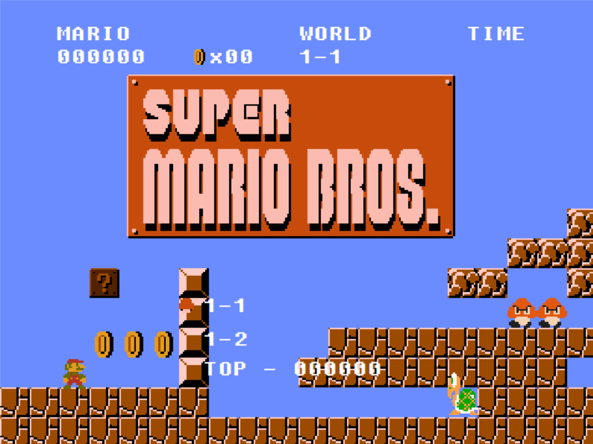
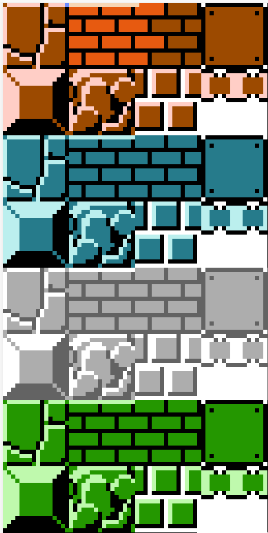
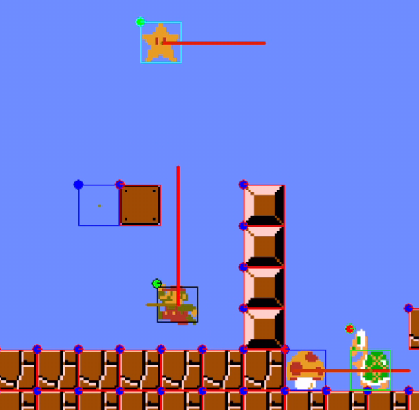

# Super mario Bros

made by tuxiaobei

四川大学程序设计基础（C语言）与安全：游戏项目（2021级大一上）



## 项目基础简介

开发环境：Microsoft Visual Studio Community 2022 (64 位) - Current 版本 17.0.0

开发语言标准：C++14

使用图形库：[Easy Graphics Engine(EGE)](https://xege.org/)

请先安装字体文件 [resources/fonts/Fixedsys500c.ttf](https://gitee.com/tuxiaobei/mario/raw/master/resources/fonts/Fixedsys500c.ttf)

## 操作方式

### 菜单页面

上/下方向键：切换关卡

Enter 键：进入关卡

D 键：开启/关闭调试模式

### 游戏页面

左/右方向键：向左/右移动

下方向键：在大状态情况下蹲

X 键：跳跃（在一定范围内，按下时间越长，横向速度越快，跳跃高度越高）

长按 Z 键：加速冲刺

短按 Z 键：在火焰马里奥状态下射出火球

D 键：开启/关闭调试模式

## 关卡编辑

位于 `level_data` 目录下，文件后缀名为 `.mio`，文件名即为关卡名。

基础格式：

```
map_range 35 //设置地图大小
limit_time 120 //设置时间上限
end
表世界关卡元素（一行一个）
-1 -1
里世界关卡元素（一行一个，暂未实现）
-1 -1
```

每一行首先是两个数，表示元素位置坐标 $x$ ，$y$​，一个空格后接素材命令

### 素材命令

#### 砖块




```
4 <初始造型行数> <初始造型列数>
```

#### 板栗

```
5 <初始方向向左-1/向右1>
```

#### 问号砖

```
9 <是否隐藏0/1> <出现的角色命令>
```

#### 蘑菇


```
11 <初始造型行数> <初始造型列数> <初始方向向左-1/向右1>
```

#### 金币

```
12
```

#### 乌龟

```
13 <初始造型行数> <初始造型列数> <初始方向向左-1/向右1>
```

#### 火焰花


```
14 <初始造型行数> <初始造型列数>
```

#### 无敌星


```
15 <初始造型行数> <初始造型列数> <初始方向向左-1/向右1>
```

### 调试模式

按 D 键，开启/关闭调试模式



方框表示碰撞箱的大小和位置，不同颜色表示不同的碰撞图层

圆点表示角色贴图绘制位置的左上角，蓝色表示静态物体，绿色表示动态物体在空中，红色表示动态物体在地面。

从碰撞箱中心发出的两条线的长度代表角色受外力的情况（不含摩檫力与引力），颜色表示速度大小（越红速度越快）。

## 项目结构

本项目采用面向对象的设计思路，以下列举的是类的实现，类的声明均在同名的 `.h` 文件中。

### 全局相关

`main.cpp` 程序初始化和渲染循环控制

`global.cpp` 全局变量和函数

`keymsg.cpp` 键盘信息的接收和处理

`musicplayer.cpp` 音乐文件的读取和控制

`camera.cpp` 图片素材的读取和渲染控制

`headers.cpp` 顶端分数、金币、关卡名和时间显示

### 页面相关

`menu.cpp` 菜单页面和选关控制

`load_screen.cpp` 加载页面

### 关卡相关

`level.cpp` 关卡读取和总体控制

`collider.cpp` 碰撞箱与物理引擎（以下所有类均继承于此）

#### 关卡内部角色/动画

`mario.cpp` 马里奥

`mario_fire.cpp` 马里奥火球

`freeze_block.cpp` 静态砖块

`flagpole.cpp` 终点旗杆与旗帜

`death_animation.cpp` 角色被击杀动画‘

`add_score.cpp` 分数增加动画

#### 关卡可编辑角色

`brick.cpp` 标准砖块

`chestnut.cpp` 板栗

`coin.cpp` 金币

`flower.cpp` 火焰花

`mushroom.cpp` 蘑菇

`question_block.cpp` 问号砖块/隐藏砖块

`star.cpp` 无敌星

`tortoise.cpp` 慢慢龟

### 其他数据文件

`graphics.txt` 图片素材位置数据

一行一个类型素材的位置数据：

```
<素材路径> <初始左上角x坐标> <初始左上角y坐标> <素材宽度> <素材高度> <纵向(y方向)重复次数> <纵向(y方向)每次读取偏移量> <横向(x方向)重复次数> <横向(x方向)每次读取偏移量> <素材名称>
```

可通过 `Costume` 结构体（位于 `global.h`）访问素材造型，由三个 `int` 变量（`a`，`b`，`c`）组成，依次表示造型类型行数，行数（从 $0$ 计数），列数（从 $0$​​ 计数）

`level_data` 关卡地图数据目录

`resources` 图片和音频素材目录

## 参考资料

1. 素材来源：<https://github.com/justinmeister/Mario-Level-1>
2. EGE 图形库：<https://xege.org/>
3. EGE 图形库文档：<https://blog.csdn.net/qq_39151563/category_9311717.html>

## 注意事项

本项目可能在 AMD 平台的机器上出现兼容性问题，如果出现游玩问题请提交 issue